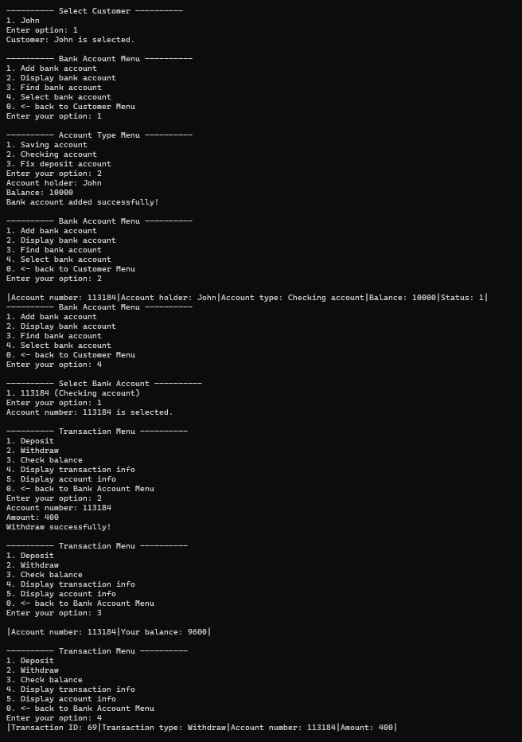

# Banking System

This is a C++ console application for a basic banking management system, allowing users to manage banks, customers, and bank accounts.

## Features

- Add and manage multiple banks
- Add customers to banks
- Create different types of bank accounts (Checking, Saving, Fixed Deposit)
- Perform transactions like deposit and withdrawal
- Track account details and transaction history

## How to Run

1. Clone repository https://github.com/Meimei07/cplusplus-banking-system.git

2. Go to location:
"cplusplus-banking-system\x64\Debug"

3. Run "Practice(03).exe"

### Compiler

Compile with a C++ compiler

## Demo

demonstration of adding bank account, deposit/withdraw, and view transaction

